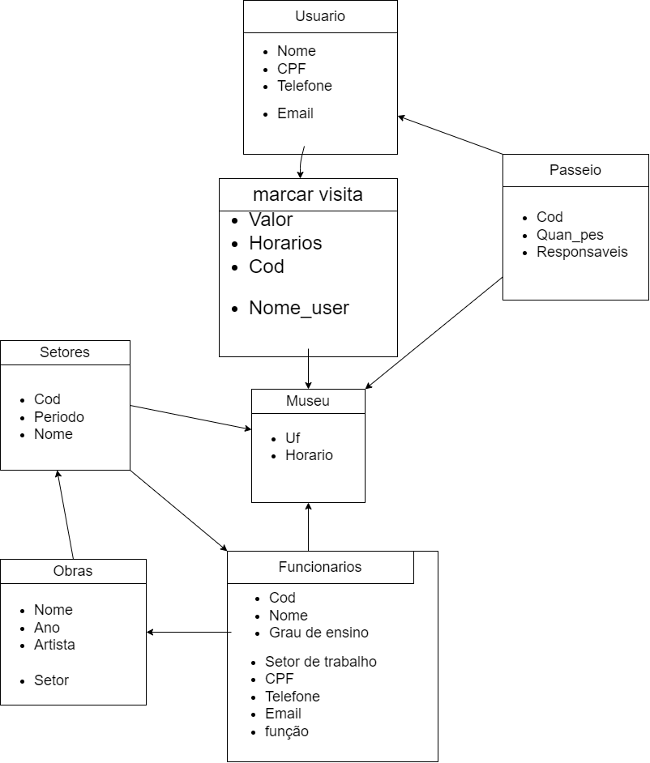

# 🏛️ Sistema de Gerenciamento de Museus

Este sistema foi desenvolvido como parte da disciplina de Programação e Engenharia de Software (PES) do Instituto Federal de Santa Catarina. O objetivo do projeto é criar uma aplicação colaborativa para o gerenciamento de controle de estoque, com interfaces gráficas e integração com banco de dados, além do uso de modelagem de software para garantir uma estrutura sólida, facilitando a manutenção, escalabilidade e eficiência no desenvolvimento da aplicação

# Sistema de Gerenciamento de Museus

A aplicação permite o gerenciamento completo de setores, obras de arte, funcionários, usuários e visitas ao museu. Entre as principais funcionalidades, estão:

    Cadastro e organização de obras e setores por período histórico;

    Gerenciamento hierárquico de funcionários;

    Registro de usuários e compra de ingressos com controle de horário e regras de acesso;

    Controle de visitas individuais e excursões com limite de pessoas.

O sistema foi desenvolvido em Python, com interface gráfica feita em Tkinter, banco de dados local SQLite e utilização do Peewee para facilitar a manipulação dos dados. Todo o projeto foi acompanhado por documentação técnica com a modelagem dos requisitos, diagramas e estrutura de dados.

## Requisitos Funcionais (RF)

- RF01. O sistema deve permitir que o funcionário cadastre novos funcionários, informando: nome, data de nascimento, grau de ensino, setor de trabalho e código.
- RF02. O sistema deve permitir que o dono cadastre setores do museu, informando: obras pertencentes, funcionário responsável e período histórico. 
- RF03. O sistema deve permitir que o funcionário cadastre novas obras, informando: nome, ano de criação e artista responsável.
- RF04. O sistema deve permitir que o funcionário registre relações hierárquicas, informando o código do chefe e o código do funcionário.
- RF05. O sistema deve permitir o cadastro de informações gerais sobre o museu, incluindo UF (unidade federativa) e setores.
- RF06. O sistema deve permitir que o visitante realize seu cadastro, informando: nome, CPF, telefone e e-mail.
- RF07. O sistema deve permitir que o visitante compre ingressos, informando: tempo, horário, código e identificação do visitante.
- RF08. O sistema deve registrar as visitas realizadas pelos usuários, associando o horário, o visitante e o ingresso.
- RF09. O sistema deve permitir o registro de excursões, informando: quantidade de pessoas, responsável e código da excursão.

## Requisitos Não Funcionais (RNF)

- RNF01. Apenas funcionários com o código “chefe” podem registrar novos funcionários.
- RNF02. O sistema deve considerar um funcionário como “ativo” se estiver trabalhando, e “desativado” caso contrário.
- RNF03. Cada setor do museu deve estar vinculado a um período histórico.
- RNF04. Cada setor deve possuir pelo menos um funcionário responsável.
- RNF05. Todas as obras devem ser expostas ao público.
- RNF06. Todas as obras devem estar protegidas por uma camada de vidro.
- RNF07. Um funcionário pode possuir mais de um chefe.
- RNF08. As informações gerais sobre o museu devem ser visíveis a todos os usuários.
- RNF09. O visitante poderá se cadastrar presencialmente em terminais físicos no museu ou de forma online, via site.
- RNF10. O visitante poderá permanecer no museu apenas pelo tempo estipulado no tíquete.
- RNF11. O visitante poderá acessar qualquer área do museu que esteja liberada ao público.
- RNF12. Caso o visitante ultrapasse 5 minutos após o vencimento do tíquete, será aplicada uma multa.
- RNF13. A compra de ingressos só será permitida para visitantes previamente cadastrados.
- RNF14. Todas as visitas deverão ser registradas no sistema.
- RNF15. Somente o responsável pela excursão precisa estar cadastrado no sistema.
- RNF16. Durante o cadastro de excursão, deve-se informar a faixa etária dos participantes.
- RNF17. A excursão pode ter no máximo 10 pessoas, mas podem ocorrer excursões simultâneas do mesmo local.

## Documentação

| Ferramentas             | Finalidade                                                                 |
|-------------------------|---------------------------------------------------------------------------|
| **Python 3**            | Linguagem de programação utilizada para desenvolver toda a aplicação      |
| **SQLite**              | Banco de dados relacional local utilizado para armazenar as informações do sistema |
| **Peewee**              | ORM (Object-Relational Mapping) utilizado para facilitar a manipulação do banco de dados com Python |
| **Tkinter**             | Biblioteca gráfica utilizada para desenvolver a interface do usuário       |
| **Visual Studio Code (VS Code)** | Ambiente de desenvolvimento (IDE) utilizado para escrever, organizar e executar o código-fonte |

## Diagramação 

## Banco de Dados

Ao executar o arquivo Python principal, um banco de dados local será criado automaticamente utilizando SQLite, sem a necessidade de um servidor SQL instalado.  
Toda a estrutura do banco de dados será gerada dinamicamente com base nos modelos definidos com Peewee.

## Para utilizar esse codigo é necessario ter instalado o Python, Peewee e sqlite.

https://www.python.org/downloads/

python3 --version

pip install sqlite

pip install peewee
  

